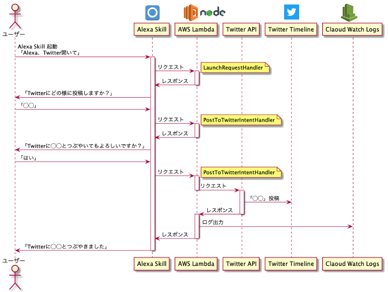

Alexaを使ってTwitterへ投稿アプリ
====

[Qiita](https://qiita.com/Takayoshi_Makabe/items/8278aedb80014c2da04e) にも記事として投稿しています。こちらの記事はTwitterでなく、slackへの投稿ですが内容はほぼ同じなので、詳細はそちらを参照ください。

<br />

# シーケンス図


<br />

# Usaga

1. TwitterAPIに登録し、API経由で投稿できるよう設定

2. Lambda関数作成後、以下の手順でローカルからソースコードをアップロード

```
$ git clone git@github.com:spider-man-tm/alexa-twitter.git

# クローンしたディレクトリに移動後、初期化＆必要なモジュールをインストール
$ sh setup.sh
```

3. 出力されたzipファイルをlambdaにアップロード

4. Lambda関数の環境変数として先ほど発行されたTwitterAPIの諸々を登録

5. 下記記事を参考にAlexaSkillのスロット、インテントを作成

「Alexa、出勤！」で快適なリモートワークを [[Qiita記事]](https://qiita.com/Takayoshi_Makabe/items/8278aedb80014c2da04e)

6. Lambda関数のトリガーとして、先ほど作成したAlexaSkillを登録

7. AlexaSkillのエンドポイントとして、先ほど作成したLambda関数のARNを登録

8. AlexaSkillをデプロイ（ボタン押下で簡単にできます）
